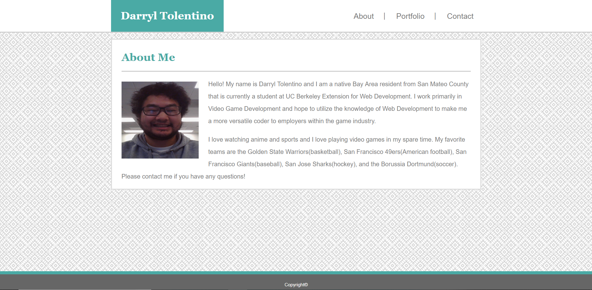
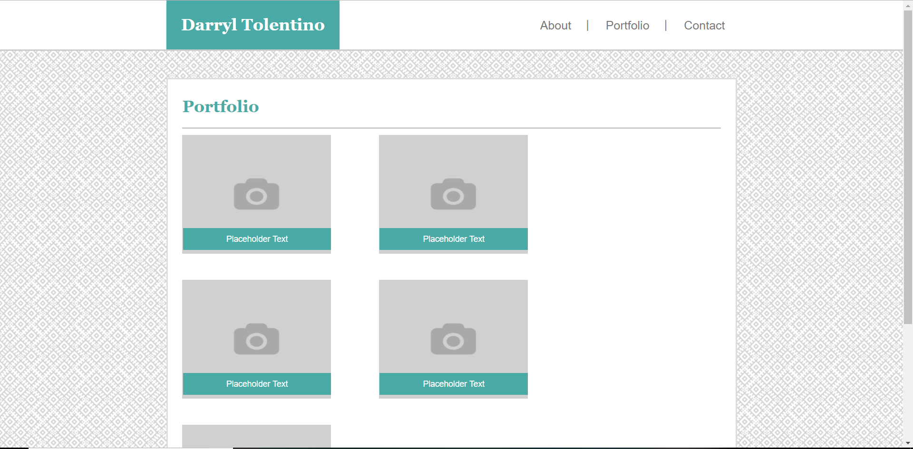
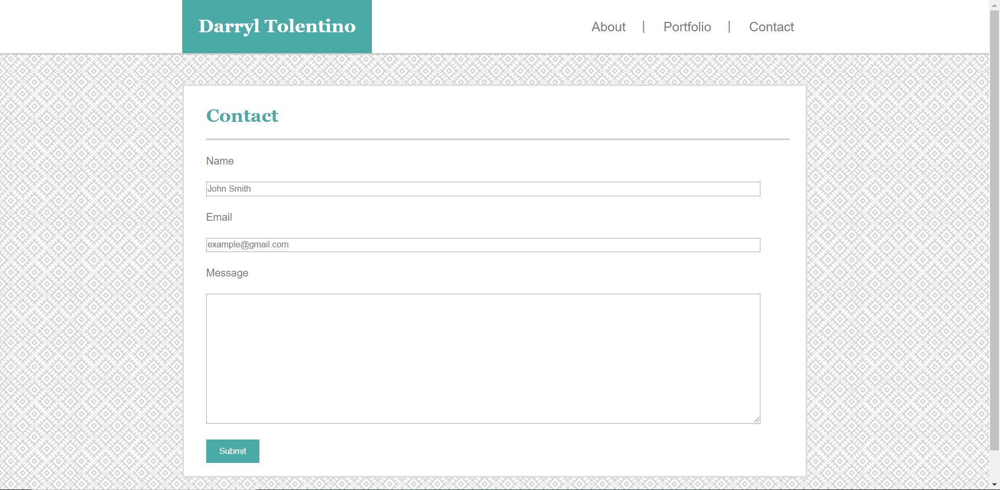

# Basic-Portfolio

This is a basic portfolio website that has three pages: an About Me, a Portfolio, and a Contact Form page. Each page has a header that has my name and a navigation bar that can be used to jump in between the pages using the same window. 
The About Me page has a photo of myself and a description of who I am as a developer and a person. My Portfolio page currently has five placeholder images with placeholder text that will be linked to projects that I complete in the future or have completed already but have yet to link to. The Contact Form provides a place to give a name, email, and a message field in order for someone to contact me via the website.

## Technologies Used
1) [HTML](https://developer.mozilla.org/en-US/docs/Web/HTML)
2) [CSS](https://developer.mozilla.org/en-US/docs/Web/CSS)

## Versioning
1) [Github](https://github.com)

## Author
- Darryl Tolentino

## Acknowledgements
- Jake Dudum: For inspiration and encouragement while working on this project.